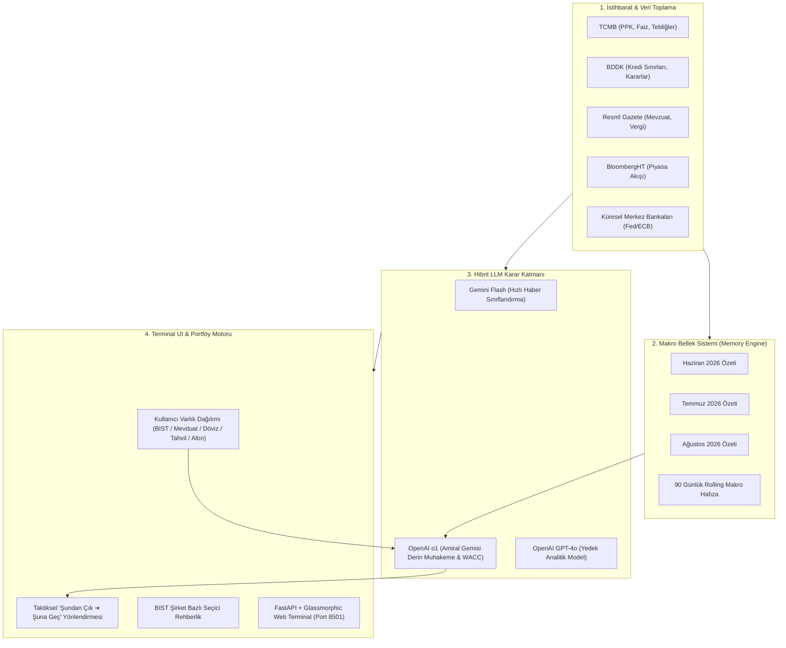

# 🦅 YATIRIM RADARI (Investment & Macro Intelligence Terminal)

> **Türkiye ve Küresel Piyasalar için Makro İstihbarat, Hibrit LLM Analiz ve Taktiksel Portföy Yönetim Terminali**

Yatırım Radarı; Türkiye Cumhuriyet Merkez Bankası (**TCMB**), Bankacılık Düzenleme ve Denetleme Kurumu (**BDDK**), **T.C. Resmî Gazete** ve **BloombergHT** gibi birincil regülasyon ve haber kaynaklarını anlık tarayan, bunları küresel makroekonomik eksenle (**Fed**, **ECB**, **IMF**) birleştiren ve yatırımcının portföyüne özel taktiksel geçiş kararları üreten kurumsal düzeyde bir makro terminaldir.

---

## ⚡ Temel Yetenekler ve Mimari



---

### 1. Yerli & Küresel Makro Radar Katmanı
* **TCMB:** Para Politikası Kurulu (PPK) faiz kararları, zorunlu karşılıklar (ZK) ve basın duyuruları doğrudan taranır.
* **BDDK:** Kredi kartı/bireysel kredi sınırları, bankacılık sermaye yeterlilik oranları ve likidite kararları izlenir.
* **T.C. Resmî Gazete:** Vergi kanunları, stopaj düzenlemeleri ve Cumhurbaşkanlığı kararları filtrelenir.
* **BloombergHT:** Finans piyasası haberleri, kur ve borsa gelişmeleri taranır.

---

### 2. Hibrit Yapay Zeka Mimarisi (Cost-Effective & Uncompromised Flagship)
* **Günlük Haber Taraması:** Ücretsiz ve yüksek kotalı `gemini-flash-latest` ile çalışır. Kota/hız sınırına takıldığında otomatik `gpt-4o-mini` failover devreye girer.
* **Portföy Karar & Taktik Motoru:** 100.000 TL+ gibi gerçek sermaye kararları için OpenAI'ın en üst düzey amiral gemisi **`o1`** modeli kullanılır. Model; WACC, risksiz getiri oranı, borsa F/K çarpanları ve para politikasının reel sektöre aktarım mekanizmasını derin matematiksel ve iktisadi muhakemeyle sentezler.
* **Akıllı Hiyerarşi:** `o1` ➔ `gpt-4o` ➔ `gpt-4o-mini` ➔ `gemini-flash`.

---

### 3. 3 Aylık Hiyerarşik Makro Bellek Sistemi (Memory Digest)
* Her analizde tüm geçmiş haber metinlerini baştan göndermek yüksek token maliyetine ve bağlam kirliliğine yol açar.
* Sistem her takvim ayı kapandığında 30 günlük dönemi damıtarak tek bir **Makro Konsolide Bellek Kartı** (`macro_memory_digest`) oluşturur.
* Portföy motoru bu 3 aylık birikimli hafızayı (`2026-06`, `2026-07`, `2026-08` ve `rolling_90d`) okuyarak faiz artışlarının veya indirimlerinin gecikmeli kümülatif etkilerini hesaplar.

---

### 4. Taktiksel Portföy Yönlendirmesi ("Şundan Çık ➔ Şuna Geç")
* Kullanıcı mevcut varlık dağılımını girer (BIST Hisseleri, TL Mevduat/PPF, Döviz Nakit/KKM, DİBS & Tahvil, Gram Altın).
* Yapay zeka terminali aktif makro rejimi teşhis eder:
  * **Sıkı Para Politikası:** Yüksek TL mevduatı ve defansif nakit zengini BIST şirketleri önerilir.
  * **Faiz İndirim Döngüsü:** Hisselere ve büyüme şirketlerine geçiş teşvik edilir.
  * **Volatilite & Kriz:** Gram Altın ve döviz likiditesi artırılır.
* **Şirket Bazlı Rehberlik:** Rejime göre BIST'te öne çıkan (ör. ENKAI, BIMAS, FROTO) ve baskı altında kalan şirket grupları gerekçeleriyle listelenir.

---

## 🚀 Hızlı Başlangıç

### 1. Depoyu Klonlayın
```bash
git clone https://github.com/Gehrman-Sparrow42/YATIRIM_RADARI.git
cd YATIRIM_RADARI
```

### 2. Bağımlılıkları Yükleyin
```bash
pip install -r requirements.txt
```

### 3. Ortam Değişkenlerini Tanımlayın
`.env.example` dosyasını `.env` olarak kopyalayın ve API anahtarlarınızı girin:
```ini
# Gemini API Key (Varsayılan haber sınıflandırma)
GEMINI_API_KEY=AIzaSy...

# OpenAI API Key (o1 portföy karar motoru)
OPENAI_API_KEY=sk-proj-...

# Model Tercihleri
OPENAI_MODEL_REASONING=o1
OPENAI_MODEL_HEAVY=gpt-4o
GEMINI_MODEL=gemini-flash-latest
```

### 4. Terminali Başlatın
```bash
# Web Arayüzünü Başlat (Varsayılan Port: 8501)
python run.py --dashboard

# Veya Windows'ta tek tıkla başlat:
Run_Terminal.bat
```
Tarayıcınızdan `http://127.0.0.1:8501` adresine giderek terminali kullanmaya başlayabilirsiniz.

---

## 🛠️ CLI Komutları

| Komut | Açıklama |
|---|---|
| `python run.py --dashboard` | Web terminal arayüzünü ayağa kaldırır. |
| `python run.py --run-once` | Tek seferlik tüm kaynakları tarar, LLM analizi yapar ve veritabanını günceller. |
| `python run.py --daemon` | Saatlik periyotlarla sürekli arka plan tarama modunda çalışır. |
| `python run.py --backfill` | Geçmiş 3 aylık makro haberleri sentetik olarak derler ve hafıza tablosunu oluşturur. |

---

## 📂 Dizin Yapısı

```
YATIRIM_RADARI/
├── radar_core/             # Çekirdek Kütüphane (ORM Modelleri, Veritabanı, Hibrit LLM Motoru)
│   ├── config/             # Ayar sınıfları (Pydantic Settings)
│   ├── core/               # database.py, llm_engine.py, models.py
│   └── pipelines/          # Temel pipeline protokolleri
├── radar_macro/            # Makro Terminal Servisleri
│   ├── config/             # Makroya özel ayarlar
│   ├── fetchers/           # TCMB, BDDK, Resmî Gazete, BloombergHT web crawlerları
│   ├── memory_engine.py    # 3 Aylık özet ve 90 günlük rolling bellek yöneticisi
│   ├── pipeline.py         # Makro istihbarat işleme hattı
│   ├── portfolio.py        # OpenAI o1 destekli taktiksel portföy copilotu
│   ├── server.py           # FastAPI REST API & Statik dosya sunucusu
│   ├── web/                # Glassmorphic Terminal Web UI (HTML, CSS, JS)
│   └── run.py              # CLI yöneticisi
├── run.py                  # Kök çalıştırma betiği
├── Run_Terminal.bat        # Windows başlatıcı
├── requirements.txt        # Python bağımlılıkları
├── .env.example            # Örnek ortam değişkenleri şablonu
└── .gitignore              # Gizlilik ve önbellek kuralları
```

---

## 🔒 Güvenlik ve Gizlilik
* Hassas API anahtarları (`OPENAI_API_KEY`, `GEMINI_API_KEY`) ve yerel SQLite veritabanı dosyaları (`*.db`) `.gitignore` ile korunmaktadır ve depoya dahil edilmez.
* Canlı portföy oranlarınız yerel SQLite veritabanınızda saklanır; dış sunuculara sadece anonim makro göstergeler gönderilir.
