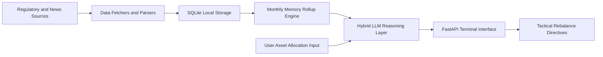

# yatirim-radari

Macroeconomic regulatory scraper, automated digest engine, and portfolio allocation decision-support terminal for Turkish and global financial markets.

## Overview

Yatırım Radarı is an automated intelligence pipeline and local analytical terminal. It ingests primary regulatory and monetary policy bulletins (TCMB, BDDK, Turkish Official Gazette, BloombergHT, and global central bank feeds), filters legislative and interest rate actions into structured SQLite storage, generates a monthly rolling macroeconomic memory digest, and provides asset-allocation tactical guidance through a local FastAPI web interface.

## Architecture and Pipeline

The application operates as a sequential data ingestion and decision engine with hierarchical model fallback.



- Data Ingestion: Asynchronous and scheduled fetchers poll primary sources (Central Bank of Turkey, Banking Regulation and Supervision Agency, Official Gazette, BloombergHT RSS/HTML) at configurable intervals.
- Normalization and Filtering: HTML and RSS payloads are parsed using BeautifulSoup and Feedparser. Articles and decrees are validated against content-length and keyword thresholds, then persisted into `macro_radar.db`.
- Macro Memory Engine: Aggregates historical items into calendar-month summaries (30-day and 90-day rolling digests) to preserve longitudinal policy context without context-window overflow.
- Reasoning Layer: Uses dual-provider LLM routing. High-frequency classification and parsing use Gemini Flash with automatic failover to GPT-4o-mini. Complex multi-asset allocation decisions route through reasoning models (OpenAI o1 / GPT-4o).
- Delivery: A local FastAPI dashboard serves the terminal UI, showing regulatory alerts, sentiment scores, macro indicators, and portfolio reallocation guidance.

## Tech Stack

| Component | Technology | Description |
| :--- | :--- | :--- |
| Runtime | Python 3.10+ | Core language environment |
| Backend Server | FastAPI, Uvicorn | Local analytical web server and REST API |
| Database | SQLite, SQLAlchemy 2.0+ | Relational persistence for news, digests, and portfolio state |
| Ingestion / Parsing | HTTPX, BeautifulSoup4, Feedparser | Network client and DOM parsing utilities |
| Intelligence Routing | Google GenAI SDK, OpenAI Python SDK | Dual-provider LLM routing and reasoning engine |
| Frontend | HTML5, CSS3, Vanilla JavaScript | Responsive terminal dashboard |

## Project Structure

```text
YATIRIM_RADARI/
├── .env.example              # Environment variables template
├── .gitignore                # Git ignore rules
├── README.md                 # Technical documentation
├── requirements.txt          # Python dependency manifest
├── Run_Terminal.bat          # Windows batch startup launcher
├── run.py                    # Application bootstrap and entrypoint
├── radar_core/               # Shared abstractions and data contracts
│   ├── core/                 # LLM engine, schemas, and persistence
│   └── pipelines/            # Base pipeline definitions
├── radar_macro/              # Macro intelligence module
│   ├── config/               # Source endpoints and scraping rules
│   ├── fetchers/             # Domain-specific web scrapers
│   ├── portfolio.py          # Allocation and asset scoring logic
│   ├── server.py             # FastAPI routing and endpoints
│   └── web/                  # HTML templates, stylesheets, and client JS
└── scripts/                  # Seed, migration, and verification utilities
```

## Setup and Prerequisites

### Prerequisites
- Python 3.10 or higher
- Valid API keys for Google Gemini and/or OpenAI

### Installation

1. Navigate to the project directory:
   ```bash
   cd c:/Tools/YATIRIM_RADARI
   ```

2. Create and activate a virtual environment:
   ```bash
   python -m venv .venv
   .venv\Scripts\activate
   ```

3. Install required packages:
   ```bash
   pip install -r requirements.txt
   ```

4. Initialize environment configuration:
   ```bash
   copy .env.example .env
   ```

5. Set your provider credentials in `.env`:
   ```ini
   GEMINI_API_KEY="your_gemini_api_key"
   OPENAI_API_KEY="your_openai_api_key"
   DATABASE_URL="sqlite:///./macro_radar.db"
   ```

## Usage Examples

### Starting the Intelligence Terminal
Run the main startup script:
```bash
python run.py
```
Or execute the Windows launcher:
```bash
Run_Terminal.bat
```

The terminal interface will be accessible at:
```text
http://127.0.0.1:8501
```

### Running Headless Intelligence Scrape
To trigger a manual ingestion cycle without launching the full web dashboard:
```bash
python -c "from radar_macro.server import run_scraping_cycle; run_scraping_cycle()"
```

### Configuration Environment Variables

| Variable | Default Value | Description |
| :--- | :--- | :--- |
| `GEMINI_API_KEY` | None | API key for Google Gemini model calls |
| `OPENAI_API_KEY` | None | API key for OpenAI model calls |
| `DATABASE_URL` | `sqlite:///./macro_radar.db` | SQLAlchemy connection string |
| `DEFAULT_POLL_INTERVAL`| `3600` | Fetch frequency in seconds |
| `LLM_ROUTING_STRATEGY` | `smart_hybrid` | Strategy for routing between fast and reasoning models |

## Notes and Constraints

- Primary Source Availability: Government gazette and institutional sites occasionally employ rate-limiting or anti-bot protections. Scraping clients enforce user-agent rotations and sequential delays.
- Model Fallback Logic: If the primary Google Gemini quota is exhausted (HTTP 429), the engine automatically falls back to `gpt-4o-mini` to prevent pipeline stalls.
- Data Storage: Local SQLite storage is maintained in WAL mode (`macro_radar.db`). For concurrent write heavy scenarios, set connection timeouts appropriately.
